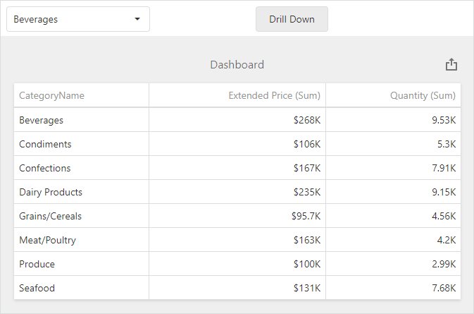

<!-- default badges list -->

<!-- default badges end -->

# Dashboard for Web Forms - How to Drill-Down on the Client

<!-- run online -->
**[[Run Online]](https://codecentral.devexpress.com/128579898/)**
<!-- run online end -->

The following example shows how to drill down in the Web Dashboard control on the client side.

The example contains a [dxSelectBox](https://js.devexpress.com/DevExtreme/ApiReference/UI_Components/dxSelectBox/Configuration/) UI component, a [Grid](https://docs.devexpress.com/Dashboard/117161/web-dashboard/create-dashboards-on-the-web/dashboard-item-settings/grid) dashboard item, and a button.

The [ViewerApiExtension.getAvailableDrillDownValues](https://docs.devexpress.com/Dashboard/js-DevExpress.Dashboard.ViewerApiExtension?p=netframework#js_devexpress_dashboard_viewerapiextension_getavailabledrilldownvalues_itemname_) method call obtains the categories available for drill-down in the Grid item. The `dxSelectBox` uses these categories as a data source. When you select the category in the select box and click the **Drill Down** button, the [ViewerApiExtension.performDrillDown](https://docs.devexpress.com/Dashboard/js-DevExpress.Dashboard.ViewerApiExtension?p=netframework#js_devexpress_dashboard_viewerapiextension_performdrilldown_itemname_value_) method call drills down in the specified row in the Grid item.

When the Grid displays a list of products (the bottom-most detail level), you can only drill up, and the Drill Down button is changed to **Drill Up**. When you click the **Drill Up** button, the [ViewerApiExtension.performDrillUp](https://docs.devexpress.com/Dashboard/js-DevExpress.Dashboard.ViewerApiExtension#js_devexpress_dashboard_viewerapiextension_performdrillup_itemname_) method is called. This action returns you to the top detail level (a list of categories). The [ViewerApiExtension.canPerformDrillDown](https://docs.devexpress.com/Dashboard/js-DevExpress.Dashboard.ViewerApiExtension#js_devexpress_dashboard_viewerapiextension_canperformdrilldown_itemname_) and [ViewerApiExtension.canPerformDrillUp](https://docs.devexpress.com/Dashboard/js-DevExpress.Dashboard.ViewerApiExtension#js_devexpress_dashboard_viewerapiextension_canperformdrillup_itemname_) method calls check whether the Drill-Down or Drill-Up are available. 

## Files to Review

* [Default.aspx](./CS/ASPxDashboard_PerformDrillDown/Default.aspx) (VB: [Default.aspx](./VB/ASPxDashboard_PerformDrillDown/Default.aspx))
* [DrillDown.js](./CS/ASPxDashboard_PerformDrillDown/Scripts/DrillDown.js) (VB: [DrillDown.js](./VB/ASPxDashboard_PerformDrillDown/Scripts/DrillDown.js))

## Documentation

- [Drill-Down](https://docs.devexpress.com/Dashboard/117061/web-dashboard/create-dashboards-on-the-web/interactivity/drill-down)

## More Examples

- [Dashboard for MVC - How to Drill-Down on the Client](https://github.com/DevExpress-Examples/mvc-dashboard-drill-down-in-code)
- [Dashboard for Web Forms - How to update the parameter value when the item's master filter state is changed](https://github.com/DevExpress-Examples/web-dashboard-update-parameter-master-filter-changed)
- [Dashboard for MVC - How to Apply Master Filter on the Client](https://github.com/DevExpress-Examples/mvc-dashboard-apply-master-filtering-in-code)
- [Dashboard for Web Forms - How to apply Master Filtering in OLAP mode](https://github.com/DevExpress-Examples/web-forms-dashboard-apply-master-filtering-in-olap)
- [Dashboard for Web Forms - How to Apply Master Filter on the Client](https://github.com/DevExpress-Examples/asp-net-web-forms-dashboard-apply-master-filter-in-code)
